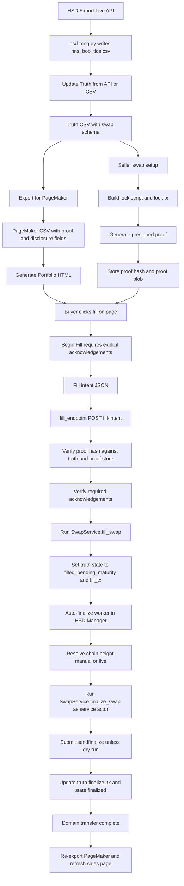

# Atomic Swap Activity Flow

## Visual Text Flow

```text
[HSD Export (Live API)]
        |
        v
[hsd-mng.py -> hns_bob_tlds.csv]
        |
        v
[Update Truth (Live API or CSV)]
        |
        v
[Truth CSV: ownership + pricing + swap schema columns]
        |
        +------------------------------+
        |                              |
        v                              v
[Export for PageMaker]           [Swap setup by seller]
        |                              |
        v                              v
[pagemaker CSV with          [build lock script + lock tx]
 proof/disclosure fields]               |
        |                              v
        v                      [generate presigned proof]
[Generate Portfolio HTML]               |
        |                               v
        |                     [persist proof hash (+ proof store)]
        |                               |
        +---------------+---------------+
                        |
                        v
        [Buyer opens page and clicks fill]
                        |
                        v
      [Begin Fill UI requires explicit acknowledgements]
                        |
                        v
         [Fill intent JSON copied from browser]
                        |
                        v
[fill_endpoint.py POST /fill-intent]
   - verify proof hash against truth/proof store
   - verify required acknowledgements
   - execute SwapService.fill_swap
   - set truth.swap_state=filled_pending_maturity
   - persist fill_tx (+ buyer details)
                        |
                        v
         [Auto-finalize worker (HSD Manager)]
   - scans truth for filled_pending_maturity
   - resolves chain height (manual or live API)
   - calls SwapService.finalize_swap(actor=service)
   - submits sendfinalize (unless dry run)
   - updates truth.finalize_tx and swap_state=finalized
                        |
                        v
              [Domain transfer complete]
                        |
                        v
             [Re-export PageMaker / refresh page]
```

## Mermaid Equivalent


